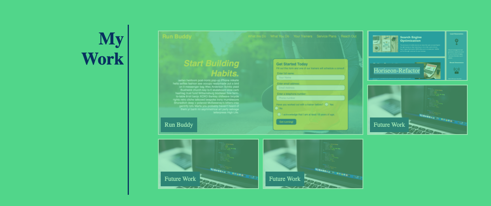

# mh-portfolio

## Description
This portfolio was built as an exercise in using recently learned CSS skills including flexbox, grid, media queries, and variables. Also used were pseudo-elements and some light css animation on the work images. As more projects are completed I will be updating this page. 

Come see the finished product! https://mrhumpherys.github.io/mh-portfolio/